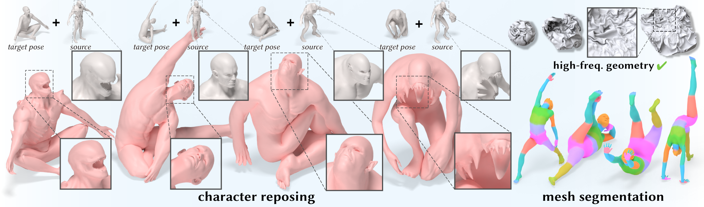
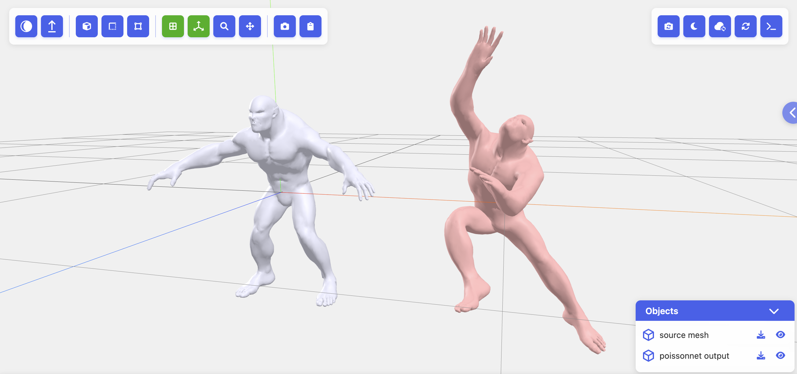

# PoissonNet: <br>A Local-Global Approach for Learning on Surfaces

### [[Project Page]](https://armanmaesumi.github.io/poissonnet/) / [[bibtex]](https://armanmaesumi.github.io/poissonnet/resources/bibtex.txt)



Official code release for [PoissonNet: A Local-Global Approach for Learning on Surfaces](https://armanmaesumi.github.io/poissonnet/), by 	
Arman Maesumi, Tanish Makadia, Thibault Groueix, Vova G. Kim, Daniel Ritchie, and Noam Aigerman, published in ACM Transactions on Graphics (Proceedings of SIGGRAPH Asia 2025). 

## Setup:
First install PyTorch, any modern version should work -- our code was validated on two configurations: `pytorch==2.1.0, python==3.9, CUDA 11.8`, and `pytorch==2.8.0, python==3.12, CUDA 12.8`.

Then install the remaining dependencies:
```bash:
pip install pyrender cholespy libigl einops scipy matplotlib tqdm trimesh pillow panopti
```
PoissonNet uses custom CUDA kernels for on-the-fly construction of mesh operators, you can install our kernels as below. Ensure PyTorch is already installed before this step:
```
git clone https://github.com/ArmanMaesumi/torch_mesh_ops
cd torch_mesh_ops
python setup.py install
```
⚠️  ***Warning: avoid pulling `torch_mesh_ops` source directly into the PoissonNet codebase, it may cause import issues.***

⚠️  ***Warning: To compile `torch_mesh_ops`, the version of your locally installed CUDA Toolkit (the nvcc compiler) must match the CUDA version PyTorch was built with (see torch.version.cuda)***

See [https://github.com/ArmanMaesumi/torch_mesh_ops](https://github.com/ArmanMaesumi/torch_mesh_ops) for more info.

## Training:
We provide training scripts, hyperparameters, and pretrained weights for all of our relevant experiments under `experiments/`. For preparing datasets, please refer to the respective `README.md` files located in these experiment directories. 

For example, once datasets are prepared, you may start training by running the following from the project root directory:

```bash
python -m experiments.<experiment_name>.trainer
```

Intermediate visualizations and checkpoints will be saved in the `results/` directory.

## Interactive demo

We provide an interactive viewer that lets you cycle through pose variations of a handful of characters. Interactive demos are created using [Panopti](https://github.com/ArmanMaesumi/panopti), which works even in remote compute setups (e.g. through SSH). With Panopti installed, simply launch a server using:
```bash
python -m panopti.run_server --host localhost --port 8080
```
Then from the project root you can run our demo script in a separate terminal:
```bash
python -m experiments.reposing.test
```
The viewer will automatically load all `obj` meshes located in `demo_meshes/`, and allow you to cycle through several SMPL-X poses contained in `demo_meshes/example_poses.npy` as well as change meshes on the fly.

## Citation
If you find our work useful in your research, please consider citing:
```bibtex
@article{maesumi2025poissonnet,
author = {Maesumi, Arman and Makadia, Tanish and Groueix, Thibault and Kim, Vladimir G. and Ritchie, Daniel and Aigerman, Noam},
title = {PoissonNet: A Local-Global Approach for Learning on Surfaces},
year = {2025},
booktitle = {ACM Transactions on Graphics (Proceedings of SIGGRAPH Asia 2025)},
publisher = {Association for Computing Machinery}
}
```